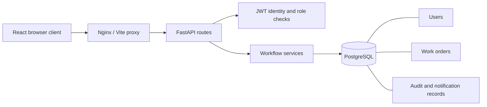

# Architecture and permissions

The backend is a modular monolith. SQLAlchemy models describe persistence, Pydantic schemas validate input, and workflow services centralize transition and authorization rules. Alembic owns schema changes. React uses a typed API client and a same-origin proxy, avoiding cross-origin configuration in the starter.

## Access matrix

| Capability | Requester | Technician | Supervisor | Administrator |
| --- | --- | --- | --- | --- |
| Submit requests | Yes | No | Yes | Yes |
| Read orders, history, attachments | Own | Assigned | All | All |
| Set initial requested priority | Yes | — | Yes | Yes |
| Reprioritize / assign | No | No | Yes | Yes |
| Record progress and notes | No | Assigned | All | All |
| Complete / reopen completed work | No | Assigned | All | All |
| Close work | No | No | Yes | Yes |
| Attach built-in samples | Own, open | Assigned, open | All open | All open |
| Dashboard / CSV report | Own | Assigned | All | All |
| List users | No | No | Yes | Yes |
| Create users via API | No | No | No | Yes |

Visibility applies to collection, detail, attachment, history, dashboard, and export endpoints. Inaccessible records return 404. Work-order mutations use a PostgreSQL row lock to serialize updates; audit records and notifications commit with the same transaction. No endpoints delete or edit audit events.

## Data and workflow

Users have a role. Work orders reference a requester and optional technician, hold a maintenance/inspection type, and record creation, due, and closure timestamps. Audit events capture actor, action, detail, and time. Notifications belong to one user. Attachments reference only catalog keys for static sample text.

Workflow updates reject status skipping, assignment to non-technicians, unauthorized priority changes, and edits after closeout. Requesters can request an initial priority; supervisors own subsequent triage.

## Authentication

Passwords are Argon2-hashed. A successful login returns a 60-minute HS256 token. Tokens hold a user identifier and expiration; each request reads the current role from the database. Browser tokens remain in memory. Logout clears the browser token but does not revoke an already-issued token server-side. There is no public registration or password-reset flow.

## Metrics and exports

Open means not closed. Overdue means not closed and due before the current time. Average completion is elapsed calendar days from submission to closeout, over closed work only. Completed count includes completed and closed statuses. Recurrence counts categories with two or more requests. Every metric is scoped to the caller's visibility.

Search matches title, description, and location. Queue pages contain up to 200 records (20 in the UI). CSV export includes all matching visible records and protects leading spreadsheet formula characters. Dashboard aggregation and CSV serialization currently run in application memory; move aggregation and large exports into dedicated database queries/jobs when scale warrants it.
