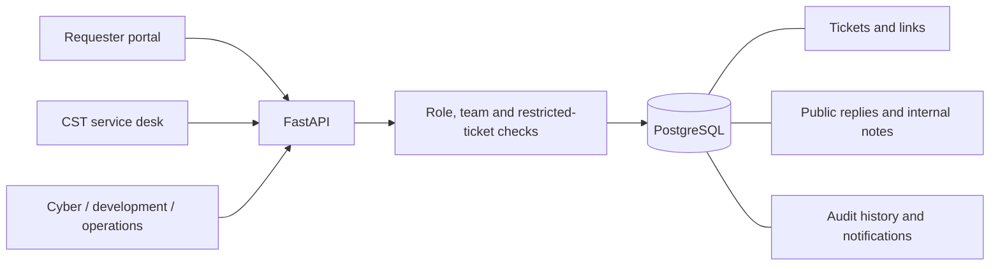

# Internal IT prototype architecture

ManageX Hub is a single-organization prototype for CST ticket tracking, with optional cross-team tasks. There is no billing, tenant model, or SaaS onboarding.

## Workflow

`submitted → assigned → in_progress → completed → closed`

Assigned or in-progress work may become blocked. Blocked work returns to in progress. Completed work can return to in progress. A supervisor or administrator closes work. Closed records are read-only.

Assignment requires an agent in the owning team. Supervisors can transfer an ordinary ticket between CST, Development and IT Operations; this clears the assignee and resets status to submitted. A cybersecurity handoff creates a separate restricted task instead of changing an existing ticket's confidentiality.

Linked tasks have independent status and are not hard dependencies. Creating a child does not copy the parent's description, comments, or attachments. The author enters the information needed by the receiving team. Neither child completion nor parent closeout automatically changes the other record.

## Access rules

| Capability | Requester | Agent | Supervisor | Administrator |
| --- | --- | --- | --- | --- |
| Create tickets | CST support, service, access | All queues | All queues | All queues |
| Read ordinary tickets | Own | Own team plus tickets they submitted | All | All |
| Read restricted cybersecurity tasks | No | Cybersecurity agents only | Cybersecurity supervisors only | Yes |
| Update workflow | No | Owning team | Visible tickets | All |
| Assign or change priority | No | No | Visible tickets | All |
| Transfer ordinary tickets / close | No | No | Visible tickets | All |
| Public replies | Own open tickets | Visible open tickets | Visible open tickets | All open tickets |
| Internal notes / audit history | No | Visible tickets | Visible tickets | All |
| Create linked tasks | No | Owning team | Visible tickets | All |
| Create accounts via API | No | No | No | Yes |

A user has one team in this prototype. The existing database role `technician` is displayed as **Agent** in the interface. Supervisors have organization-wide access to ordinary tickets; team-scoped supervisory roles are future work. Any task routed to Cybersecurity is restricted, even when it is not of type `security`. Security-type tasks are always routed to Cybersecurity.

Visibility is applied to lists, details, comments, history, linked tickets, sample attachments, dashboard aggregates, CSV exports, and notifications. Links omit inaccessible records entirely. Staff who create a restricted handoff receive a delivery acknowledgment but cannot subsequently read it unless authorized. Requesters see public conversation and current status; full audit entries remain staff-only because legacy audit text may contain internal notes.

Notifications contain generic activity messages and a ticket reference, never comment contents. Their visibility is reevaluated when read so a former owner cannot use an old notification to inspect a transferred ticket. Legacy notifications without a ticket reference remain stored but are omitted from the new inbox.

## Persistence and migration

The existing `work_orders` table and foreign keys are retained to preserve records. The API now uses `/api/tickets` and `/api/reports/tickets.csv`; the frontend calls these paths. The `location` database/API field is presented as “Affected device or service.” Audit and assignment updates share a transaction and use PostgreSQL row locks.

Migration `2b_it_workflow` adds team/restriction fields, comments, links, and notification references. Existing records default to CST and remain accessible through the **Legacy maintenance records** type filter. They are excluded from IT metrics and default queues. Existing passwords are unchanged. Explicit IT seeding adds missing demo accounts and eight scenarios once, using an audit marker to prevent duplication.

The migration's downgrade intentionally refuses to discard new data. To roll back, restore a known backup with the matching prior application version. Review and protect backups independently; backups are not committed to this repository.

## Authentication and operating limits

Argon2 password hashes, expiring JWTs, in-memory browser tokens, and database-loaded role checks carry over. Reloading requires sign-in. Logout clears the browser token without server-side revocation. Roles and teams can be assigned at account creation through the administrator API; management UI and membership editing are not implemented.

Metrics cover all visible IT tickets, not only the selected queue or filter. Open includes completed tickets until closeout; overdue means open and past target date. Targets are due dates, not business-hours SLA timers. Search covers title, description, and affected device/service. CSV exports include only matching visible tickets and no discussion content.

The prototype assumes a small local evaluation. Revisit shared-device session handling, identity integration, backup restoration, account lifecycle, rate limiting, monitoring, and HTTPS before approving operational deployment. Restricted queues are application access controls, not a compliance certification.
