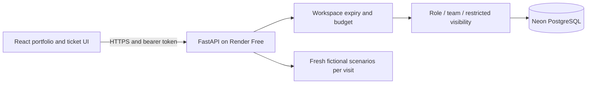

# ManageX Hub — portfolio walkthrough

ManageX Hub demonstrates an IT ticket workflow from intake to closeout. The challenge is coordinating departments while keeping requesters, staff, and restricted security work within their intended access boundaries.

## Try these scenarios

1. **Triage:** start as Supervisor, open Shared printer unavailable and assign Jordan Ellis.
2. **Troubleshoot:** switch to CST agent, set In progress, post a public reply and a fictional internal note.
3. **Compare perspectives:** switch to Requester. The public reply is visible; the internal note and staff audit history are not.
4. **Handoff:** as CST agent, create a linked Development bug or a restricted Cybersecurity task. Switch to the receiving role and inspect the independent record.
5. **Closeout:** complete work as agent, then close as supervisor. Closed tickets reject further updates.

Each visitor gets their own temporary workspace. Switching roles stays in that workspace; other visitors cannot see or change its tickets. Sessions expire and are cleaned up. All scenarios are fictional. The portfolio version does not expose an administrator persona.

## Engineering decisions

| Decision | Purpose and tradeoff |
| --- | --- |
| React/TypeScript + FastAPI | Explicit browser/API contracts; a service layer owns workflow rules |
| SQLAlchemy + Alembic | Persistent relational data and reviewable, additive schema changes |
| Workspace boundary before role policy | All ticket queries are isolated before applying role/team/restricted rules |
| Separate public/internal comments | Requesters get public conversation; staff notes stay server-filtered |
| Atomic state updates and row locks | Failed multi-field updates do not partially change a ticket |
| Signed session and access tokens | No public demo passwords; switching only within a signed, unexpired workspace |
| Expiry, capacity and mutation budgets | Keep demo storage bounded for a small free database |
| Static portfolio + sleeping API | Entry page stays accessible while free compute starts |
| Liveness separate from database readiness | Platform probes avoid continuously using Neon compute |

## Architecture

The frontend can be explored by keyboard and at narrow widths. It shows actionable errors for capacity limits, expiry and free-host wake-up delays. API regression tests cover the policy boundary; Playwright tests connect the browser flow to real backend operations.

## Deliberate boundaries

This is a portfolio application using fictional data. It does not implement organizational SSO, production account administration, email delivery, real uploads, approval chains or SLA clocks. Linked tasks have independent states; they do not automatically block a parent's closeout. Demo workspace isolation is not a general paid multi-tenant product.

For setup, see [free deployment](deploy-free.md). For existing workflow rules, see [architecture](architecture.md). No performance, availability or compliance claims are implied by the demo.
